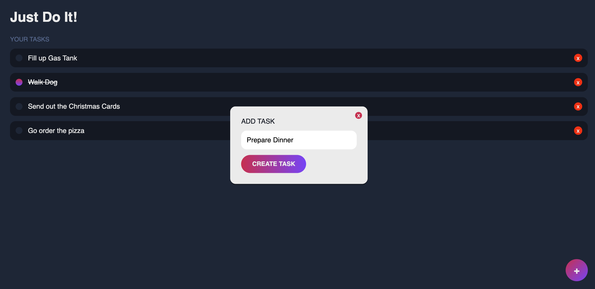

# JustDoIt

A small project using the MERN stack that allows a user to create tasks, mark them as complete, and then delete them.

## Purpose

The purpose of this project is to familiarize myself with MERN (MongoDB, Express, React, Node)

## Features

- Create, update, and delete tasks.
- Mark tasks as complete.
- Intuitive user interface for managing tasks.

## Installation and Setup

To run this project on your local machine, follow these steps:

1. Clone the repository
2. cd into both client and api and npm i
3. Make sure MongoDB is installed and turned on
4. cd into api and run npm start
5. cd into client and run npm start
6. Go to http://localhost:3000/

